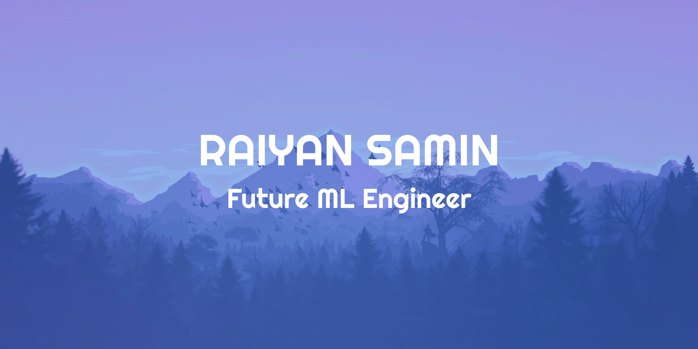

  

<h1 align="center">Hi there, I'm Raiyan! 👋</h1>

I'm a Computer Engineering student at the University of Waterloo with a passion for machine learning and artificial intelligence. I'm enthusiastic about exploring innovative technologies and solving real-world problems through coding and design.

I am currently interested in: 
* 🚀 Exploring the Frontiers of AI and Machine Learning
* 🚴‍♂️ Balancing Tech with Fitness and Health
* 👾 Gaming Tech and Virtual Reality
* 🎙️ Exploring Voice Assistants and Speech Recognition
* 🌌 Space Exploration: Analyzing Astronomical Images

<h2 align="center">🌐Socials</h2>

  
  
  

<h2 align="center">💻Tech Stack</h2>

<h3>Languages</h3>
  
     

<h3>AI/ML Tools</h3>

     

<h3>Web Dev</h3>

 	 

<h3>Others</h3>

  

Feel free to explore my GitHub repositories for more projects and code samples!

